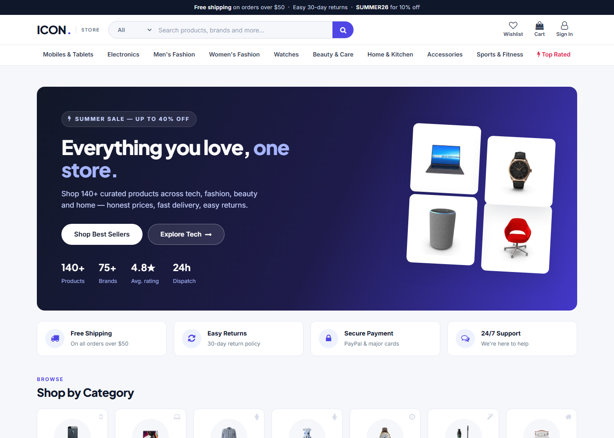

# ICON Store — MERN E-commerce Platform

A modern, full-stack e-commerce application with a premium light-themed UI:
140+ products across 9 categories, search with faceted filters, wishlist,
cart, checkout with PayPal / Cash-on-Delivery, order history with PDF
invoices, plus separate **Seller** and **Admin** portals.



## Quick start

No database setup required — the backend ships with an embedded JSON
datastore and seeds itself with a full catalog and demo accounts on first
run.

```bash
# 1. Install dependencies (root + frontend)
npm install
cd frontend && npm install && cd ..

# 2. Start the API (port 5000)
node backend/server.js

# 3. Start the frontend (port 3000) — in a second terminal
cd frontend
./start-dev.cmd        # Windows (sets NODE_OPTIONS for react-scripts 4)
# or: NODE_OPTIONS=--openssl-legacy-provider npm start
```

Open http://localhost:3000

### Demo accounts

| Role   | Email                | Password  |
| ------ | -------------------- | --------- |
| User   | demo@iconstore.com   | demo123   |
| Seller | seller@iconstore.com | seller123 |
| Admin  | admin@iconstore.com  | admin123  |

(Also shown on the sign-in page with one-click autofill.)

## Features

**Shopper**
- Landing page with hero, category cards, deals / best sellers / new
  arrivals / trending / recommended rails, featured brands, newsletter
- Product cards with brand, rating, discount %, stock status, wishlist
  toggle, quick-view modal and add-to-cart
- Product page with image gallery + zoom, specifications, reviews,
  frequently-bought-together and similar products
- Search by name / brand / category, sidebar filters (category, brand,
  price presets + custom range, rating), client-side sort, in-stock
  toggle, pagination
- Cart with quantity steppers and free-shipping threshold, wishlist,
  multi-step checkout (shipping → payment → review), PayPal sandbox or
  Cash-on-Delivery, order history, PDF invoice, order cancellation

**Seller** — request product listings, track request status, manage own
products. **Admin** — dashboard with user/seller/order counts, approve or
reject seller requests, full product CRUD.

## Tech stack

- **Frontend:** React 17, Redux + thunk, React Router 5, plain CSS design
  system (custom properties, no UI framework), Create React App
- **Backend:** Node.js, Express, JWT auth, bcrypt, express-fileupload
- **Data:** lightweight embedded datastore (`backend/db.js`) with a
  mongoose-like API, persisted as JSON under `backend/storage/`; seed
  catalog in `backend/data.js` (product data & photography from the
  open [dummyjson](https://dummyjson.com) dataset)
- **Integrations:** PayPal JS SDK (sandbox), optional Twilio SMS, jsPDF

## Deployment

The app deploys as two pieces:

**API → Render** (repo includes [`render.yaml`](render.yaml)):
1. In Render: *New → Blueprint*, pick this repo — it creates the
   `icon-store-api` web service (free plan) automatically.
2. Note the service URL, e.g. `https://icon-store-api.onrender.com`.

**Frontend → Vercel**:
1. In Vercel: *Add New → Project*, import this repo and set
   **Root Directory** to `frontend`.
2. Add an environment variable
   `REACT_APP_API_URL = https://<your-render-service>.onrender.com`.
3. Deploy — build command and SPA rewrites are already configured
   (`frontend/vercel.json`).

Note: on Render's free tier the JSON datastore resets whenever the
instance sleeps or redeploys — the catalog and demo accounts re-seed
automatically on startup, so the store always works; only user-created
data (orders, registrations) is ephemeral.

## Screenshots

See the [`screenshots/`](screenshots) folder for full-page captures of the
home page, category browsing, product details, cart and mobile views.
